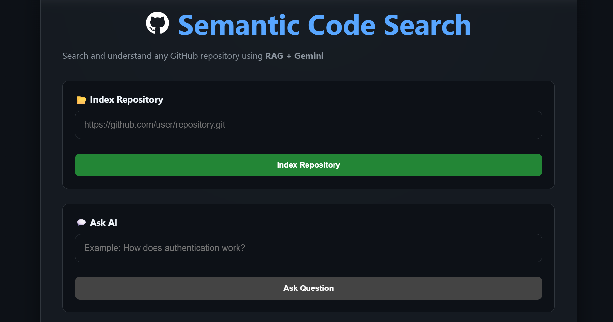
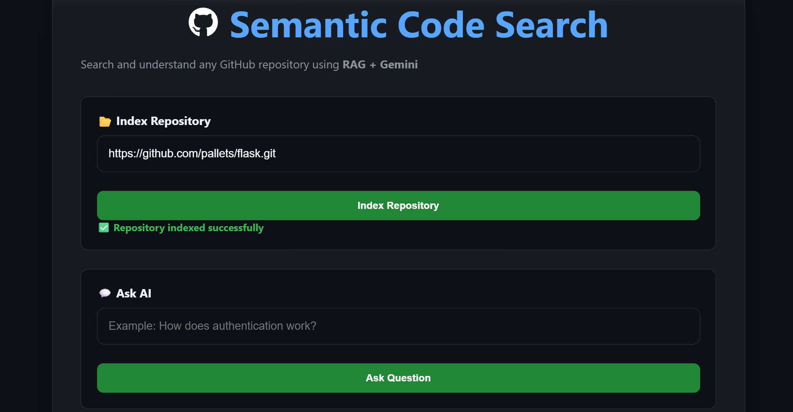
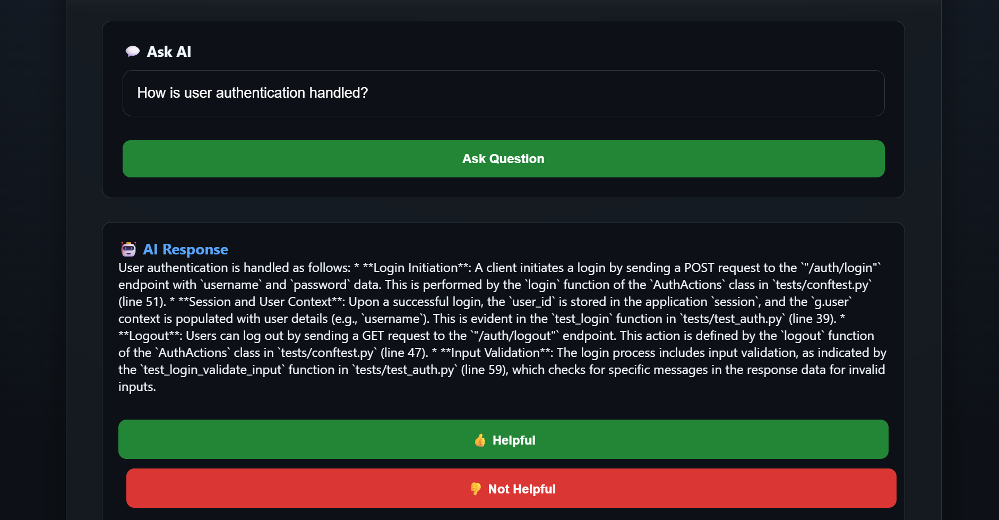
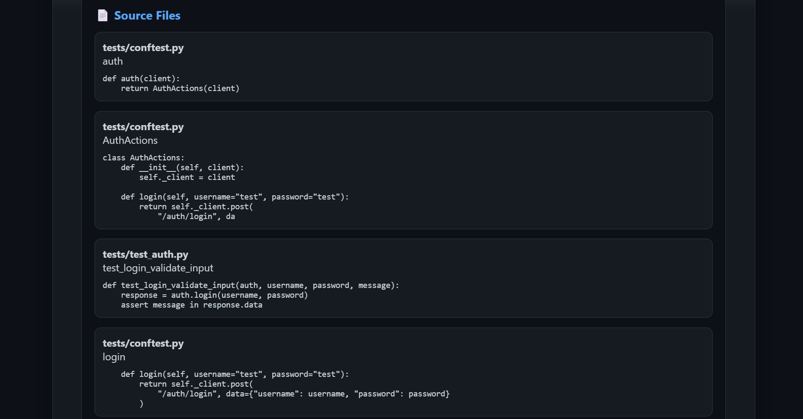

# Semantic Code Search

An AI-powered Semantic Code Search application that enables users to index GitHub repositories and ask natural language questions about the codebase using Retrieval-Augmented Generation (RAG).

---

## Features

- 🔍 Semantic code search using Sentence Transformers
- 🤖 AI-powered answers using Google Gemini
- 📂 GitHub repository indexing
- 🧠 ChromaDB vector database for semantic retrieval
- 📝 Query logging
- 👍 User feedback collection
- 📊 Automated evaluation framework
- 🔄 Smart re-indexing using SHA-256 change detection
- 🌐 REST API built with FastAPI
- 💻 Interactive React frontend

---

## Architecture

1. Clone GitHub repository
2. Parse Python files
3. Chunk functions and classes
4. Generate embeddings using Sentence Transformers
5. Store embeddings in ChromaDB
6. Retrieve relevant code using semantic search
7. Generate answers using Google Gemini

## Tech Stack

### Frontend
- React
- Vite
- Axios

### Backend
- Python
- FastAPI
- ChromaDB
- Sentence Transformers
- Google Gemini API
- GitPython

---

## Project Structure

```
semantic-code-search/
│
├── backend/
│   ├── app/
│   ├── evaluation/
│   ├── Dockerfile
│   ├── requirements.txt
│   └── ...
│
├── frontend/
│   ├── src/
│   ├── public/
│   ├── package.json
│   └── ...
│
├── README.md
└── .gitignore
```

---

## Installation

## Deployment

- **Frontend:** Vercel
- **Backend:** Railway

### Backend

```bash
cd backend
pip install -r requirements.txt
uvicorn app.main:app --reload
```

### Frontend

```bash
cd frontend
npm install
npm run dev
```

---

## API Endpoints

| Method | Endpoint | Description |
|---------|----------|-------------|
| POST | `/index` | Index a GitHub repository |
| POST | `/query` | Ask questions about the indexed repository |
| POST | `/feedback` | Save user feedback |

---

## Screenshots

### Home Page



### Repository Indexed



### AI Response



### Source Files



## Live Demo

Frontend: https://semantic-code-search-black.vercel.app

Backend: https://semantic-code-search-production-d7e1.up.railway.app

## Future Improvements

- Multi-language code support
- Support for multiple repositories
- Incremental indexing
- User authentication
- Improved retrieval accuracy
- Advanced analytics dashboard

---

## Author

**Himani Jangid**

B.Tech – Artificial Intelligence & Data Science

## License

This project is developed for educational purposes.

## Project Documentation

📄 [View Project Report (PDF)](docs/Semantic_Code_Search_Project_Report.pdf)